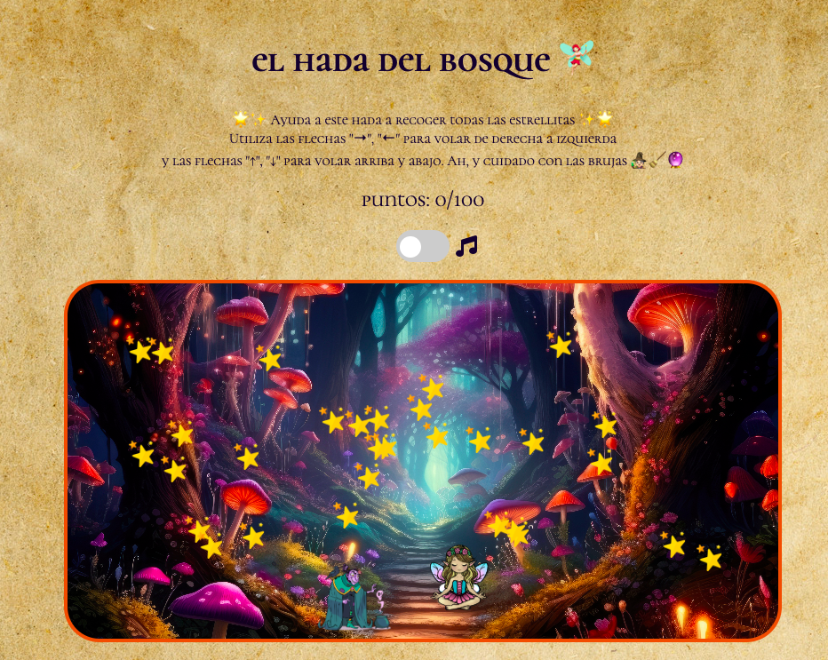

# El hada del bosque 🧚🏻‍♀️

[Juega desde aquí 🔗](https://ejemplo.com](https://sara-vazquez.github.io/game-oop/))

__El hada del bosque__ es un juego muy sencillo realizado a partir de la Programación Orientada a Objetos de Javascript. En este juego, el hada debe recoger todas las estrellas para ganar sin que la atrapen las brujas.

## 🖥 Tecnologías

## 💾 Instalación

No necesitas instalarlo, simplemente abre el link que está debajo de la foto para empezar a jugar! 🔮

## 🕹 Controles
⬆️: Utiliza la tecla de la flecha hacia arriba para volar lo más alto que puedas.

⬇️: La tecla de la flecha hacia abajo te ayudará a coger las estrellas que estén debajo. 

➡️: Con la tecla de la flecha derecha podrás desplazarte en esa dirección.

⬅️: Y la tecla de la flecha izquierda te ayudará a moverte en ese sentido.

## ✅ Features
- En este juego utilizamos el principio de herencia para poder crear a las brujas, desde la clase principal bruja, donde añadimos a la bruja que se arrastra y a la que vuela.
- Una vez que el jugador gana la partida, le saldrá una ventana modal en la que podrá reiniciar el juego a partir de un botón.
- En el caso de que pierda al ser atrapado por las brujas, mediante un bucle, creamos un alert que te de la opción de reiniciar el juego.
- Además, para que el jugador pueda meterse un poco más en el juego, se ha incluido un melodía de estilo medieval mediante un botón tipo toggle para encender o apagar la música, aunque cuando la canción llega a su fin, se apagará automáticamente, esperando a que el jugador vuelva a encenderlo.

  
## 🔜 Mejoras futuras 
- Hacer el juego responsive 📱

- Añadir un temporizador ⏱
